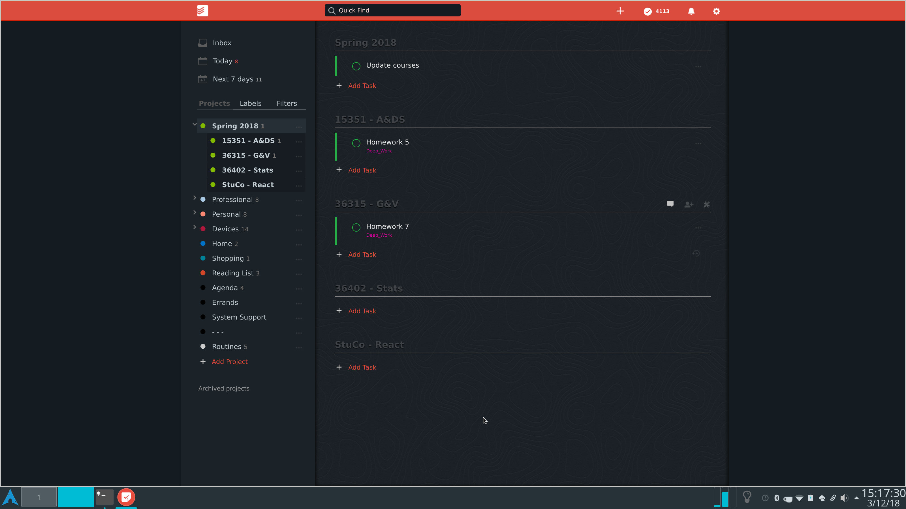

# todoist-dark-linux
My own version of Todoist. Built using Electron. Uses dark colors.

If you're interested in this and need help installing it feel free to message me. I made this for my personal use and don't want to write installation instructions that will never be read by anyone else :)

